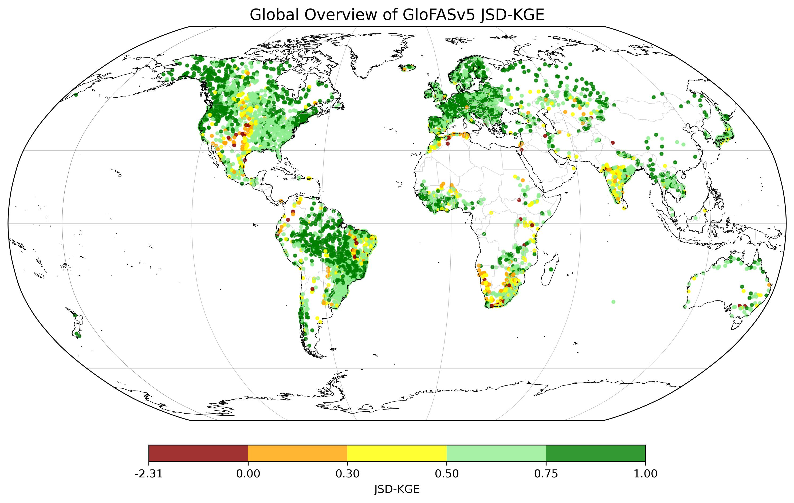

# GloFASv5 Calibration Results

This repository contains the calibration results for GloFASv5.  

The main map below shows the **global performance of the model** using the `modKGE` metric.
The calibration used >5,000 stations globally.

---

## About the Map

- **Metric**: JSD-KGE (modified Kling-Gupta Efficiency with Jensen–Shannon Divergence, see details [here](https://egusphere.copernicus.org/preprints/2026/egusphere-2026-43/))
- **Scope**: Global GloFASv5 model  
- **Purpose**: Visualizes model performance after calibration